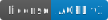

# Paremiologia catalana comparada digital (PCCD) [](https://www.gnu.org/licenses/agpl-3.0)

This is the source code of [Paremiologia catalana comparada digital](https://pccd.dites.cat/) website.

## Installation

1. Copy `.env.sample` to `.env`.

2. Build the container using the default Debian-based image:

```bash
docker compose up
```

When the database has finished importing, the website should be available at <http://localhost:8092>, depending on your
`.env` file.

Note: If you don't have a database, you can copy `tmp/schema.sql` and `tmp/schema_init_sample.sql` files to
`install/db/`. That will import an empty database and should allow you to browse the website locally.

## Updating the content and creating a new release

For detailed instructions on updating the content and pushing a new release, please see the [Content Update and Release Guide](docs/Content_Update_and_Release_Guide.md).

## Local development

### Development requirements

- PHP: version 8.4 or later is required.
- Node.js: version 20 or later is required.
- Docker.

### Assets

CSS/JavaScript code resides in `src/js/` and `src/css/`. Assets are built and minified running:

```bash
npm run build:assets
```

### Code linting, formatting and static code analysis

Linting and static code analysis:

```bash
npm run check:code
```

Automatic fixing code and formatting:

```bash
npm run fix
```

### Automated tests

```bash
npm test
```

`BASE_URL` environment variable can be overridden in tests that target the web server (e.g. Playwright):

```bash
BASE_URL=https://pccd.dites.cat npm test
```

You may need to run `npm run refresh:test-data` if the data has changed, in order to pass some e2e tests.

For running some tests in **all** pages, run:

```bash
npm run check:sitemap
```

### Profiling

SPX and XHProf profilers are available:

```bash
npm run docker:build:spx
```

```bash
npm run docker:build:xhprof
```

Profiler reports can be accessed in `/admin/`, alongside the other reports (web admin password is set in the `.env`
file).

## Contributing

For details on contributing to this repository, see the contributing guidelines:

- [English version](CONTRIBUTING.md)
- [Versió en català](CONTRIBUTING_ca.md)

## Technology stack

<a href="https://www.php.net/"></a>
<a href="https://developer.mozilla.org/docs/Web/JavaScript"></a>
<a href="https://developer.mozilla.org/docs/Web/CSS"></a>
<a href="https://httpd.apache.org/"></a>
<a href="https://mariadb.org/"></a>
<a href="https://github.com/mdbtools/mdbtools"></a>

## Copyright & License

Copyright (c) Pere Orga Esteve <pere@orga.cat>, 2020.

Copyright (c) Víctor Pàmies i Riudor <vpamies@gmail.com>, 2020.

This source code is licensed under the GNU Affero General Public License, version 3 or later, as
detailed in the [LICENSE](LICENSE) file or available at <https://www.gnu.org/licenses/agpl-3.0.html>.

Note that the database and media files are not distributed with this repository. For more details about PCCD, visit <https://pccd.dites.cat/>.

This repository includes:

- [Chart.js](https://www.chartjs.org/), licensed under the [MIT License](https://github.com/chartjs/Chart.js/blob/master/LICENSE.md).
- [Composer](https://getcomposer.org/), licensed under the [MIT License](https://github.com/composer/composer/blob/main/LICENSE).
- [Roboto font](https://github.com/googlefonts/roboto), licensed under the [Apache License Version 2.0](src/fonts/LICENSE).
- [simple-datatables](https://github.com/fiduswriter/simple-datatables), licensed under the
  [LGPL Version 3](https://github.com/fiduswriter/simple-datatables/blob/main/LICENSE).
